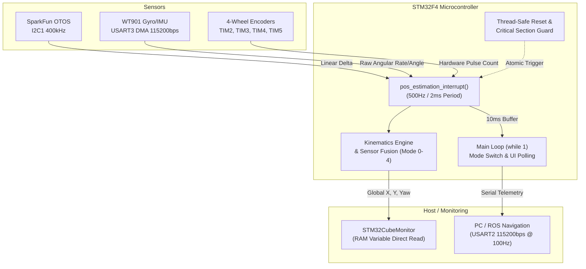

# 全方位移動ロボット 自己位置推定システム 総合技術仕様書
**System Architecture & Technical Specification Manual**

---

## 目次
1. [システム概要](#1-システム概要)
2. [ハードウェア仕様 & ピンアサイン](#2-ハードウェア仕様--ピンアサイン)
3. [自己位置推定モード仕様](#3-自己位置推定モード仕様)
4. [数学的運動学モデル & 座標変換](#4-数学的運動学モデル--座標変換)
5. [タスク・割り込みスケジューリング仕様](#5-タスク割り込みスケジューリング仕様)
6. [リセットシーケンス & 排他制御仕様](#6-リセットシーケンス--排他制御仕様)
7. [通信プロトコル仕様](#7-通信プロトコル仕様)
8. [デバッグ & STM32CubeMonitor連携仕様](#8-デバッグ--stm32cubemonitor連携仕様)
9. [ソフトウェア・ファイル構成](#9-ソフトウェアファイル構成)

---

## 1. システム概要

### 1.1 システムの目的
本システムは、全方位移動ロボット（オムニホイール / メカナムホイール等）の床面絶対座標 $(X, Y, Yaw)$ を高精度かつロバストにリアルタイム計測するための自己位置推定（オドメトリ）モジュールです。

### 1.2 コアアーキテクチャ
* **メインプロセッサ**: STMicroelectronics STM32F4シリーズ（ARM Cortex-M4F, 最大168MHz/180MHz、FPU搭載）
* **センサフュージョン構成**:
  * **光学式オドメトリセンサ (OTOS)**: SparkFun Optical Tracking Odometry Sensor (PAW3902光学センサ + 内部IMU) をI2C接続し、床面追跡変位を直接計測。
  * **9軸ジャイロ/加速度センサ (WT901)**: WitMotion製高精度IMUをUART (DMA) 接続し、姿勢角（$Yaw$）を高速追従。
  * **外付け計測輪エンコーダ**: 最大4輪のオムニ型独立計測輪をSTM32ハードウェアタイマのエンコーダモード（TIM2, TIM3, TIM4, TIM5）で常時カウント。
* **主要性能**:
  * **サンプリング周波数**: 500 Hz (2 ms 周期割り込み)
  * **外部データ出力レート**: 100 Hz (10 ms 周期デバッグ出力)
  * **座標分解能**: 0.001 mm / 0.001 deg



---

## 2. ハードウェア仕様 & ピンアサイン

### 2.1 マイコン周辺機能ピンアサイン一覧表

| モジュール | 信号名 | マイコン端子 | ペリフェラル機能 | 動作モード / 設定 |
| :--- | :--- | :--- | :--- | :--- |
| **計測輪 1** | ENC1_A | **PA0** | TIM5_CH1 | タイマ・エンコーダモード (4逓倍) |
| | ENC1_B | **PA1** | TIM5_CH2 | タイマ・エンコーダモード (4逓倍) |
| **計測輪 2** | ENC2_A | **PA15** | TIM2_CH1 | タイマ・エンコーダモード (4逓倍) |
| | ENC2_B | **PB3** | TIM2_CH2 | タイマ・エンコーダモード (4逓倍) |
| **計測輪 3** | ENC3_A | **PB6** | TIM4_CH1 | タイマ・エンコーダモード (4逓倍) |
| | ENC3_B | **PB7** | TIM4_CH2 | タイマ・エンコーダモード (4逓倍) |
| **計測輪 4** | ENC4_A | **PC6** | TIM3_CH1 | タイマ・エンコーダモード (4逓倍) |
| | ENC4_B | **PC7** | TIM3_CH2 | タイマ・エンコーダモード (4逓倍) |
| **OTOS センサ** | SCL | **PB8** | I2C1_SCL | Fast Mode 400kHz, Open Drain, Pull-up |
| | SDA | **PB9** | I2C1_SDA | Fast Mode 400kHz, Open Drain, Pull-up |
| **WT901 センサ** | TXD | **PB10** | USART3_TX | 115200 bps, 8-N-1 |
| | RXD | **PC5** | USART3_RX | 115200 bps, 8-N-1, DMA1 Stream1 Ch4 |
| **Debug UART** | TXD | **PA2** | USART2_TX | 115200 bps, 8-N-1 (ST-Link VCP) |
| | RXD | **PA3** | USART2_RX | 115200 bps, 8-N-1 (ST-Link VCP) |
| **ユーザー UI** | BUTTON | **PC13** | GPIO_Input | プルアップ入力 (青色 User Button) |
| | LED | **PA5** | GPIO_Output | プッシュプル出力 (緑色 User LED) |

### 2.2 ロボット物理諸元パラメータ

```cpp
#define ENCODER_PPR     8192     // エンコーダ1回転あたりのパルス数 (4逓倍後)
#define WHEEL_DIAMETER  78.2f    // 計測輪タイヤ直径 [mm]
#define ROBOT_RADIUS    370.0f   // ロボット中心から各計測輪接地点までの距離 [mm]
```

### 2.3 計測輪回転方向極性係数 (`ENCx_DIR`)
実機左回り（反時計回り）自転テストによる幾何学的校正値：
* `ENC1_DIR` = `+1.0f`
* `ENC2_DIR` = `-1.0f` （配線/実装による反転をソフト補正）
* `ENC3_DIR` = `+1.0f`
* `ENC4_DIR` = `+1.0f`

---

## 3. 自己位置推定モード仕様

ロボットの機体構成や搭載センサの稼働状態に応じて、PC13ユーザーボタンにより5つのモードを瞬時に切り替え可能です。

### 3.1 モード定義一覧

| モード番号 | モード名称 | 推定アルゴリズム概要 | 主な用途・特徴 |
| :---: | :--- | :--- | :--- |
| **0** | **4輪 ＋ センサ (Fusion)** | 4輪エンコーダ (30%) ＋ OTOS (70%)<br/>車輪Yaw (30%) ＋ WT901 (70%) | 計測輪と光学センサの相補利用（冗長高精度） |
| **1** | **3輪 ＋ センサ (Fusion)** | 3輪エンコーダ (30%) ＋ OTOS (70%)<br/>車輪Yaw (30%) ＋ WT901 (70%) | 正三角形3輪構成ロボットでのフュージョン |
| **2** | **センサ単独 (OTOS Only)** | **OTOS (100%) ＋ WT901 (100%)** | **【推奨/標準運用】** 車輪スリップやバウンドを完全排除した純光学式オドメトリ |
| **3** | **4輪単独 (Pure Enc 4)** | 4輪エンコーダのみで $(X, Y, Yaw)$ を算出 | OTOS未搭載・センサ故障時のフェイルセーフ |
| **4** | **3輪単独 (Pure Enc 3)** | 3輪エンコーダのみで $(X, Y, Yaw)$ を算出 | 3輪正三角形オドメトリ単体動作検証用 |

### 3.2 モード切替のUIシーケンス
1. **ボタン押下検出**: PC13ピンの立ち下がりエッジ検出後、20msのチャタリングキャンセルディレイを実行。
2. **モードインクリメント**: `position_mode = (position_mode + 1) % 5;` により循環。
3. **同期フラグ起立**: `mode_changed_flag = true;` をセットし、次回の割り込み周期で差分バッファを初期化（座標跳び防止）。
4. **シリアル通知**: デバッグUARTへ切替完了文字列を出力。
5. **LED点滅通知**: 該当モード番号 $+ 1$ 回のパルス点滅（100ms ON / 100ms OFF）を実行。

---

## 4. 数学的運動学モデル & 座標変換

本システムで採用されている幾何学数式および座標射影モデルの詳細です。

### 4.1 座標系の定義
* **グローバル座標系 $(X, Y)$**: フィールド固定の右手系直角座標系。
* **ロボットローカル座標系**: 前進方向を $+X$（または $+Forward$）、左方向を $+Y$（$+Lateral$）。
* **回転角 ($Yaw$)**: 上空から見て反時計回り（CCW: Counter Clockwise）を正 ($+$)、時計回り（CW）を負 ($-$) とする。範囲は $[-180.0^\circ, +180.0^\circ]$。

```text
               +X (Forward)
                    ▲
                    │
                    │   +Yaw (CCW)
                    │    ↺
       +Y ◄─────────┼─────────
    (Lateral)       │
                    │
```

---

### 4.2 4輪計測輪オドメトリ幾何学（四角形辺中点配置）
ロボット中心から距離 $R = 370.0\text{ mm}$ の位置に対向して配置された4つの計測輪の移動量を $ds_1, ds_2, ds_3, ds_4$ とします。

* **ローカル並進移動量**:
  $$dx_{enc} = \frac{ds_2 - ds_4}{2}$$
  $$dy_{enc} = \frac{ds_3 - ds_1}{2}$$
* **自転角速度変化量**:
  $$d\theta_{enc\_rad} = \frac{ds_1 + ds_2 + ds_3 + ds_4}{4 \times R}$$
  $$d\theta_{enc} = d\theta_{enc\_rad} \times \left(\frac{180}{\pi}\right)$$

---

### 4.3 3輪計測輪オドメトリ幾何学（正三角形配置）
$120^\circ$ 間隔で配置された3輪（車輪1: 右後, 車輪2: 左後, 車輪3: 前）の幾何学的射影：

* **ローカル並進移動量**:
  $$dx_{enc} = \frac{2 \cdot ds_3 - ds_1 - ds_2}{3}$$
  $$dy_{enc} = \frac{ds_1 - ds_2}{\sqrt{3}} \approx \frac{ds_1 - ds_2}{1.7320508}$$
* **自転角速度変化量**:
  $$d\theta_{enc\_rad} = \frac{ds_1 + ds_2 + ds_3}{3 \times R}$$
  $$d\theta_{enc} = d\theta_{enc\_rad} \times \left(\frac{180}{\pi}\right)$$

---

### 4.4 SparkFun OTOS 運動学 & キャリブレーション
OTOSセンサレジスタから読み出された移動量 `maus_data[0]` ($X_{raw}$), `maus_data[1]` ($Y_{raw}$), `maus_data[2]` ($Yaw_{raw}$) の変換：

#### スケーリング係数（LSB変換）
デフォルト工場出荷状態（インチ出力モード）の $0.01\text{ インチ/カウント}$ をメートル法（ミリメートル）へ変換：
$$0.01 \text{ inch} \times 25.4 \text{ mm/inch} = \mathbf{0.254\text{ mm/count}}$$
※ `OTOS.h` 内の `coefficient_[0]` および `coefficient_[1]` に `0.254f` を設定。

#### ローカル運動変位の導出
センサ自体の内部角度 $\theta_{otos} = \text{maus\_data}[2] \times \frac{\pi}{180}$ による回転補正：
$$dx_{sensor} = d\_odom_0 \cos(\theta_{otos}) + d\_odom_1 \sin(\theta_{otos})$$
$$dy_{sensor} = -d\_odom_0 \sin(\theta_{otos}) + d\_odom_1 \cos(\theta_{otos})$$

ロボットの機体進行軸への整合（横方向極性反転校正済み）：
$$d_{forward\_otos} = dy_{sensor}$$
$$d_{lateral\_otos} = -dx_{sensor}$$

---

### 4.5 グローバル座標への回転射影
現在のロボットの統合絶対姿勢角 $\theta_{gyro} = self\_yaw \times \frac{\pi}{180}$ を用いて、ローカル変位をグローバル座標系 $(X, Y)$ へ回転変換します。

$$\begin{bmatrix} dX \\ dY \end{bmatrix} = \begin{bmatrix} \cos(\theta_{gyro}) & -\sin(\theta_{gyro}) \\ \sin(\theta_{gyro}) & \cos(\theta_{gyro}) \end{bmatrix} \begin{bmatrix} d_{forward} \\ d_{lateral} \end{bmatrix}$$

すなわち：
$$dX = d_{forward} \cos(\theta_{gyro}) - d_{lateral} \sin(\theta_{gyro})$$
$$dY = d_{forward} \sin(\theta_{gyro}) + d_{lateral} \cos(\theta_{gyro})$$

---

### 4.6 センサフュージョン（相補フィルタ）重み付け
モード0および1において、計測輪エンコーダと各種センサ（OTOS + WT901）を以下の固定比率で相補合成します：
* **角度変化量**:
  $$d\theta_{fused} = 0.70 \times d\theta_{gyro} + 0.30 \times d\theta_{enc}$$
* **グローバル並進変位**:
  $$dX_{fused} = 0.70 \times dX_{otos} + 0.30 \times dX_{enc}$$
  $$dY_{fused} = 0.70 \times dY_{otos} + 0.30 \times dY_{enc}$$

---

## 5. タスク・割り込みスケジューリング仕様

リアルタイム性と安全性を両立させるための多重優先度スケジューリング構造です。

```text
[Hardware Timer 500Hz (2ms)] ──► Priority High: pos_estimation_interrupt()
                                   ├── Step 1: Check request_reset_position
                                   ├── Step 2: UART DMA parse (wt901.update)
                                   ├── Step 3: Read Hardware Encoders (encX.interrupt)
                                   ├── Step 4: I2C Read OTOS (otos.get_odom)
                                   ├── Step 5: Mode-switch / First-boot Sync Guard
                                   ├── Step 6: Kinematics & Coordinate Projection
                                   └── Step 7: Update self_x, self_y, self_yaw

[Main Super Loop while(1)]   ──► Priority Low: User Interface & Telemetry
                                   ├── User Button Debounce & Mode Toggle (PC13)
                                   ├── LED Pulse Blinking (PA5)
                                   ├── Non-blocking 100Hz (10ms) Telemetry via USART2
                                   └── Memory Optimization Dummy Read (CubeMonitor)
```

### 5.1 割り込み処理シーケンスの重要規則（データの鮮度保護）
リセット時やモード切替時の座標飛び（`0.x` mm の浮き）を防ぐため、**「同期ブロック（ガード）よりも前に、最新のエンコーダパルスおよびOTOS I2Cデータを読み切る」** シーケンスを厳守しています。

---

## 6. リセットシーケンス & 排他制御仕様

本システムには、組込み特有のマルチスレッド競合（レースコンディション）やハードウェアフリーズを完全に防ぐ二重の安全機構が実装されています。

### 6.1 非同期リセットフラグ・パターン
外部通信（CAN受信やシリアルコマンド等）の割り込み文脈から直接ジャイロやI2Cの重いリセット処理を呼ぶと、タイマー割り込みと衝突してマイコンがハードフォールト（HardFault）停止します。
これを回避するため、`reset_self_position()` はフラグの起立のみを行います。

```cpp
// 外部公開API (スレッドセーフ)
void reset_self_position(float x, float y, float yaw) {
    req_reset_x = x;
    req_reset_y = y;
    req_reset_yaw = yaw;
    request_reset_position = true; // フラグ起立のみで即時リターン
}
```

### 6.2 1秒間強制リセットロック (`is_resetting_yaw`)
ジャイロ内部のゼロ点収束にかかる遅延（300〜500ms）の間に発生する過渡的なノイズ差分を完全にカットするため、リセット発行後 **1000 ms の間は `self_yaw` を強制的に目標角度へクランプ** します。

### 6.3 クリティカルセクション保護 (`WT901::resetAngle()`)
DMAバッファスキャン中の割り込み競合を物理的に阻止するため、ARM CMSIS組込み関数で割り込みを排他制御します。

```cpp
void WT901::resetAngle() {
    __disable_irq(); // 割り込み一時禁止 (Critical Section Start)

    for (int i = 110 - 11; i >= 0; i--) {
        if (rx_buffer_[i] == 0x55 && rx_buffer_[i + 1] == 0x53) {
            uint8_t sum = 0;
            for (int j = 0; j < 10; j++) sum += rx_buffer_[i + j];
            if (sum == rx_buffer_[i + 10]) {
                int16_t raw_yaw = (int16_t)(rx_buffer_[i + 7] << 8 | rx_buffer_[i + 6]);
                yaw_offset_ = raw_yaw / 32768.0 * 180.0;
                data_.yaw.angle = 0.0;
                break;
            }
        }
    }

    __enable_irq();  // 割り込み復帰 (Critical Section End)
}
```

---

## 7. 通信プロトコル仕様

### 7.1 デバッグ・テレメトリ通信 (USART2)
* **物理層**: USART2 (PA2: TX, PA3: RX), 115200 bps, 8 bit, Parity None, 1 Stop bit
* **送信周期**: 10 ms (100 Hz, 非ブロッキング `HAL_GetTick()` 制御)
* **電文フォーマット**: ASCII可読テキスト
  ```text
  X:%.1f Y:%.1f Yaw:%.1f Gyro:%.1f (Mode:%d) | E1:%.1f E2:%.1f E3:%.1f E4:%.1f\r\n
  ```
* **フィールド定義**:
  * `X`: グローバルX座標 [mm]
  * `Y`: グローバルY座標 [mm]
  * `Yaw`: 統合自己姿勢角 [deg]
  * `Gyro`: WT901生ジャイロ角度 [deg]
  * `Mode`: 現在の推定モード (0〜4)
  * `E1`〜`E4`: 各車輪エンコーダの累積移動距離 [mm]

---

### 7.2 WT901 IMUバイナリ通信 (USART3)
* **物理層**: USART3 (PB10: TX, PC5: RX), 115200 bps, DMA循環バッファ (110 bytes)
* **パケット仕様**: 11 バイト固定長パケット

| オフセット | バイト値 / フィールド | 説明 |
| :---: | :--- | :--- |
| `[0]` | `0x55` | 固定同期ヘッダ |
| `[1]` | `0x51` / `0x52` / `0x53` | パケットID (51: 加速度, 52: 角速度, 53: 角度) |
| `[2..3]` | Data 1 (L / H) | Roll 軸データ (16bit Signed) |
| `[4..5]` | Data 2 (L / H) | Pitch 軸データ (16bit Signed) |
| `[6..7]` | Data 3 (L / H) | **Yaw 軸データ (16bit Signed)** |
| `[8..9]` | Data 4 (L / H) | 温度 / バージョンデータ |
| `[10]` | Checksum | `(Byte[0] + ... + Byte[9]) & 0xFF` |

---

### 7.3 OTOS I2C 通信 (I2C1)
* **物理層**: I2C1 (PB8: SCL, PB9: SDA), 通信速度 400 kHz Fast Mode
* **デバイスアドレス**: `0x17` (7-bit)
* **リード仕様**: レジスタ `0x20` から 9 ワード（18バイトまたは36バイト浮動小数点データ）を一括バースト読み出し。
  * `maus_data[0]`: X軸移動量
  * `maus_data[1]`: Y軸移動量
  * `maus_data[2]`: Yaw軸回転量

---

## 8. デバッグ & STM32CubeMonitor連携仕様

コンパイラの最適化（`-O2`, `-O3`）による変数削除やC++の名前マングリング（Name Mangling）を防ぎ、GUIツールやLive Expressionsで直接観測可能にするためのシンボル定義です。

### 8.1 監視変数一覧 (`extern "C"`)
```cpp
extern "C" {
    volatile float self_x = 0.0f;       // グローバルX自己位置 [mm]
    volatile float self_y = 0.0f;       // グローバルY自己位置 [mm]
    volatile float self_yaw = 0.0f;     // グローバルYaw自己位置 [deg]

    volatile float monitor_e1_dist = 0.0f; // 計測輪1累積移動距離 [mm]
    volatile float monitor_e2_dist = 0.0f; // 計測輪2累積移動距離 [mm]
    volatile float monitor_e3_dist = 0.0f; // 計測輪3累積移動距離 [mm]
    volatile float monitor_e4_dist = 0.0f; // 計測輪4累積移動距離 [mm]

    volatile float monitor_gyro_yaw = 0.0f; // ジャイロ生角度 [deg]
}
```

### 8.2 デッドストリップ（最適化削除）防止機構
メインループ内で `monitor_keep_alive` 変数にこれらすべての変数の和を代入するダミーリードを実行することで、リンカによる変数のメモリ配置削除を完全に防いでいます。

---

## 9. ソフトウェア・ファイル構成

```text
workspace/hoge/
├── inc/
│   └── sken_library/
│       ├── include.h         # ライブラリ一括インクルードヘッダ
│       ├── system.h / .cpp   # システム初期化・タイマー割り込み管理
│       ├── uart.h / .cpp     # UART送信およびDMA受信ドライバ
│       ├── I2C.h / .cpp      # I2C Fast-mode通信ドライバ
│       ├── encoder.h / .cpp  # ハードウェアタイマ・エンコーダドライバ
│       ├── gpio.h / .cpp     # デジタル入出力ドライバ
│       ├── OTOS.h / .cpp     # SparkFun OTOS センサ制御クラス
│       └── WT901.h / .cpp    # WitMotion WT901 IMU制御クラス
├── src/
│   ├── main.cpp              # 自己位置推定コアエンジン & メインエントリ
│   ├── stm32f4xx_it.c        # 各種ペリフェラル割り込みハンドラ
│   ├── system_stm32f4xx.c    # システムクロック設定
│   └── syscalls.c            # newlib システムコール実装
└── SPECIFICATION.md          # 本仕様書
```

---
*初版発行: 2026年9月14日*  
*開発・設計: Google DeepMind & ユーザー共同開発チーム*
